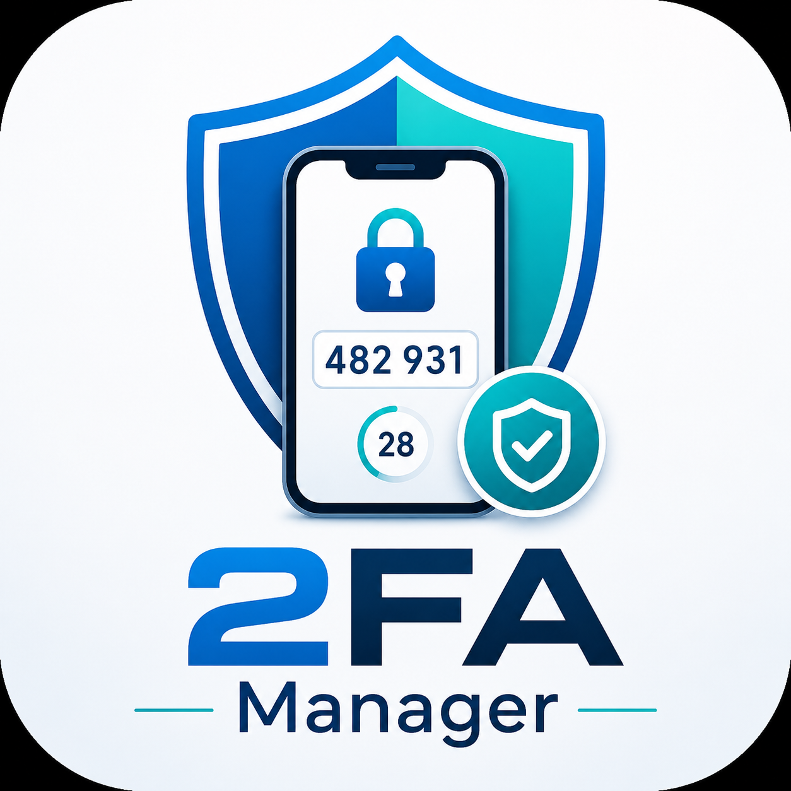

<p align="center">
  
</p>

<h1 align="center">Ghost Authenticator</h1>

<p align="center">
  <strong>Next-Generation, Offline-First 2FA / TOTP Desktop Client for Windows</strong>
</p>

<p align="center">
  <a href="https://github.com/nguyenquocanhz/ghost-authenticator/releases"></a>
  <a href="https://dotnet.microsoft.com/download/dotnet/8.0"></a>
  <a href="LICENSE"></a>
  <a href="https://nguyenquocanhz.github.io/ghost-authenticator/privacy.html"></a>
  <a href="https://apps.microsoft.com"></a>
</p>

<p align="center">
  <a href="#-key-features">Features</a> •
  <a href="#-security-architecture">Security Architecture</a> •
  <a href="#-comparison">Comparison</a> •
  <a href="#-installation">Installation</a> •
  <a href="#-building-from-source">Build</a> •
  <a href="#-compliance--policies">Policies</a> •
  <a href="#-license">License</a>
</p>

---

## 🌟 Overview

**Ghost Authenticator** is an ultra-secure, privacy-first Two-Factor Authentication (2FA) desktop manager for Windows 10 & 11. Engineered from the ground up to protect software engineers, security researchers, and privacy-conscious professionals from cloud data leaks, session hijacking, and vendor lock-in.

Unlike cloud-dependent authenticators that sync your private seeds across remote servers, **Ghost Authenticator operates 100% offline**. All cryptographic secrets are encrypted at rest with **military-grade AES-256-CBC and OWASP-standard PBKDF2 (600,000 iterations)**.

```
                    +------------------------------------+
                    |        Ghost Authenticator         |
                    |     (Local Encrypted Vault)        |
                    +-----------------+------------------+
                                      |
              [PBKDF2-SHA256: 600,000 iterations + CSPRNG Salt]
                                      v
                      +---------------+----------------+
                      |         AES-256 Engine         |
                      |   Encrypted at Rest (.ghostbak)|
                      +---------------+----------------+
                                      |
                        [In-Memory Real-Time TOTP]
                                      v
                      +---------------+----------------+
                      |       RFC 6238 6-Digit PIN     |
                      |   Auto-refreshes every 30s     |
                      +--------------------------------+
```

---

## ⚡ Key Features

- 🛡️ **Hardened Cryptographic Storage**: Secrets are never stored in plaintext. Encrypted using **AES-256-CBC** with PKCS7 padding and dynamic initialization vectors (IV) generated via `RandomNumberGenerator` (CSPRNG).
- 🔑 **OWASP US-Standard Key Derivation**: Master passwords are transformed into encryption keys via **PBKDF2-HMAC-SHA256 with 600,000 rounds**, effectively mitigating brute-force and dictionary attacks.
- 🚫 **100% Offline & Zero Telemetry**: Absolutely no network telemetry, no background metrics, no Google/Firebase analytics, and zero cloud server dependencies.
- 🔄 **Universal RFC 6238 TOTP Standard**: Full compatibility with Google, Microsoft, GitHub, AWS, Discord, Binance, Steam, Cloudflare, and over 10,000+ online services.
- 📷 **Smart QR Code Recognition**: Import 2FA accounts instantly via webcam scanner, drag-and-drop screenshot files, or direct manual Base32 key entry (powered by ZXing).
- 📦 **Encrypted Portable Container (`.ghostbak`)**: Securely backup and migrate all your authenticators between machines with encrypted container files (`GHOSTBAK_V1`).
- 🎨 **Adaptive Modern Fluent UI**: Sleek Windows 11 Fluent Design with native Dark and Light mode support, instant launch time, and ultra-low RAM footprint (<40 MB).

---

## 🔒 Security Architecture

### Cryptographic Primitives

| Component | Specification | Purpose |
| :--- | :--- | :--- |
| **Symmetric Cipher** | `AES-256-CBC` | Bulk data encryption for stored 2FA secrets |
| **Key Derivation** | `PBKDF2` (`Rfc2898DeriveBytes`) | Stretches user passwords into 256-bit symmetric keys |
| **Hash Algorithm** | `HMAC-SHA256` | Pseudo-random function used within PBKDF2 |
| **Work Factor** | `600,000` Iterations | Meets and exceeds OWASP 2024–2026 security guidelines |
| **Entropy Source** | `System.Security.Cryptography.RandomNumberGenerator` | Cryptographically secure random salts & IVs (CSPRNG) |
| **TOTP Standard** | `RFC 6238` / `RFC 4226` (HMAC-SHA1) | 30-second time-step interval, 6-digit dynamic truncation |
| **Memory Lifetime** | Ephemeral Decryption | Plaintext keys are wiped from heap immediately after TOTP cycle |

### Threat Model & Mitigations

- **Cold Boot & Physical File Theft**: If an attacker steals the local database file, they only obtain high-entropy cipher bytes. Without the master password, decrypting the 600k PBKDF2 iterations requires impractical computing power.
- **Supply Chain & Network Attacks**: Because Ghost Authenticator contains zero outbound HTTP/socket calls, secret exfiltration over the network is physically impossible.
- **Screen Hijacking Protection**: Optional obfuscation allows masking 2FA secret seeds and pins during live screen sharing or recording sessions.

---

## 📊 Comparison

| Feature | Ghost Authenticator | Google Authenticator | Microsoft Authenticator | WinAuth |
| :--- | :---: | :---: | :---: | :---: |
| **Platform** | **Windows 10 / 11** | Android / iOS | Android / iOS | Windows (Legacy) |
| **Offline-First** | **100% Yes** | Cloud Sync by default | Cloud Sync by default | Yes |
| **Zero Telemetry** | **Yes** | No | No | Yes |
| **Encryption** | **AES-256 + PBKDF2 600k** | Cloud KMS | Cloud KMS | DPAPI / AES |
| **Encrypted Backup** | **Yes (`.ghostbak`)** | Google Account Lock | Microsoft Account Lock | Plain/Pass |
| **Active Maintenance**| **.NET 8 (2026)** | Actively maintained | Actively maintained | Abandoned |
| **Windows Native UI** | **WPF Fluent Design** | Web / Mobile only | Web / Mobile only | WinForms |

---

## 🚀 Installation

### Method 1: Microsoft Store (Recommended)
Install directly from the Microsoft Store for automated background updates and sandboxed security:
[](https://apps.microsoft.com)

### Method 2: Standalone MSIX Package
Download the latest signed `.msix` release from our [Releases Page](https://github.com/nguyenquocanhz/ghost-authenticator/releases):
```powershell
Add-AppxPackage -Path .\GhostAuthenticator_1.0.0_x64.msix
```

### Method 3: Portable Self-Contained Executable
Run the pre-compiled standalone binary directly without installing dependencies:
1. Download `GhostAuthenticator.exe` from [Releases](https://github.com/nguyenquocanhz/ghost-authenticator/releases).
2. Move it to your desired folder and launch directly.

---

## 🛠️ Building from Source

### Prerequisites
- [Windows 10 (Build 19041+)](https://www.microsoft.com/software-download/windows10) or Windows 11
- [.NET 8.0 SDK](https://dotnet.microsoft.com/download/dotnet/8.0) or higher
- [Visual Studio 2022](https://visualstudio.microsoft.com/) (Optional, with *.NET Desktop Development* workload)

### Build Steps

1. **Clone the repository**:
   ```bash
   git clone https://github.com/nguyenquocanhz/ghost-authenticator.git
   cd ghost-authenticator
   ```

2. **Restore dependencies**:
   ```bash
   dotnet restore
   ```

3. **Compile and Run**:
   ```bash
   dotnet run -c Release
   ```

4. **Publish Single-File Executable**:
   ```bash
   dotnet publish -c Release -p:PublishSingleFile=true --self-contained false -o ./publish
   ```
   *(Or simply run the automated build script: [build.bat](file:///d:/GhostAuthenticator/build.bat))*

---

## 📂 Project Structure

```
GhostAuthenticator/
├── asset/                   # Logos, brand icons, and high-res vector assets
│   ├── logo.ico             # Application executable icon
│   └── *.png                # Store brand artwork
├── docs/                    # GitHub Pages portal & Microsoft Store legal pages
│   ├── index.html           # Modern interactive showcase landing page
│   ├── privacy.html         # Policy 10.5 Privacy Policy (GDPR / CCPA)
│   ├── terms.html           # Policy 10.1 Terms of Service & License
│   ├── support.html         # Policy 10.14 Customer Support & FAQ
│   └── style.css            # Responsive dark/light theme CSS
├── App.xaml                 # Global application resources and styles
├── App.xaml.cs              # Application lifecycle & global exception handling
├── Authenticator.csproj     # .NET 8 WPF modern project configuration
├── Base32.cs                # High-speed RFC 4648 Base32 alphabet decoder
├── Crypto.cs                # AES-256-CBC, PBKDF2 (600k), and .ghostbak container engine
├── MainWindow.xaml          # Responsive WPF UI layout & visual components
├── MainWindow.xaml.cs       # Interaction logic, real-time timer, and ZXing scanner
├── Totp.cs                  # RFC 6238 Time-based One-Time Password engine
└── build.bat                # Automated 1-click single-file publish script
```

---

## 📜 Compliance & Policies

Ghost Authenticator is built in strict adherence to the [Microsoft Store Policies (v7.20)](https://learn.microsoft.com/en-us/windows/apps/publish/store-policies):

- **[Privacy Policy](https://nguyenquocanhz.github.io/ghost-authenticator/privacy.html)**: Meets Section 10.5 (*Personal Information*), ensuring total data sovereignty and local isolation.
- **[Terms of Service](https://nguyenquocanhz.github.io/ghost-authenticator/terms.html)**: Meets Section 10.1 (*Distinct Function & Value*) and Section 11 (*Content Guidelines*).
- **[Support & FAQ](https://nguyenquocanhz.github.io/ghost-authenticator/support.html)**: Meets Section 10.14 (*Account & Customer Support Transparency*).

---

## 🤝 Contributing

Contributions, bug reports, and suggestions are welcome!
1. Fork the Project (`https://github.com/nguyenquocanhz/ghost-authenticator/fork`)
2. Create your Feature Branch (`git checkout -b feature/AmazingFeature`)
3. Commit your Changes (`git commit -m 'feat: add amazing feature'`)
4. Push to the Branch (`git push origin feature/AmazingFeature`)
5. Open a Pull Request

---

## 📄 License & Author

Distributed under the **MIT License**. See [LICENSE](LICENSE) for more details.

**Author**: **Nguyen Quoc Anh**  
- Email: [nguyenquocanh.dev@gmail.com](mailto:nguyenquocanh.dev@gmail.com)  
- GitHub: [@nguyenquocanhz](https://github.com/nguyenquocanhz)
